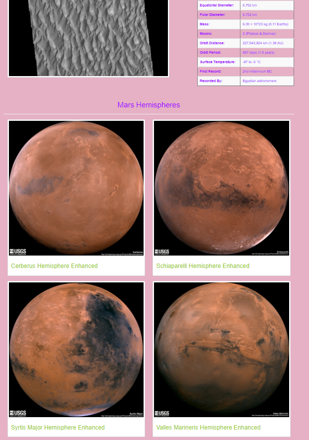
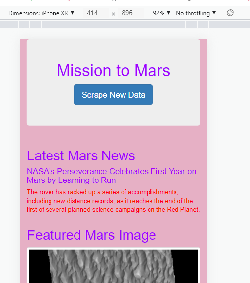

# Mission-to-Mars
## Module 10 Challenge

## Purpose
The purpose of this challenge is to enchance a scraping website that was designed to retrieve information and the latest news results about Mars from a NASA webiste. The designer wanted to add a web app that includes images of all four hemisphere of Mars, which are also avaiable from a NASA website. To do this, BeautifulSoup and Splinter are used to scrape full-resolution images of Mars’ hemispheres and the titles of those images, scraped data is stored on a Mongo database, a web application is used to display the data, and the design of the web app is altered to accommodate these images.

### Deliverable 1: Scrape High-Resolution Mars Hemisphere Images and Titles

The following code was used to scrape the High-Resolution Mars Hemisphere Images and Titles
  

### Deliverable 2: Update the Web App with Mars Hemisphere Images and Titles

### Deliverable 3: Add Bootstrap 3 Components

- Website is mobile-responsive.
- Added color changes to site.
- Added thumb-nail image.

 
